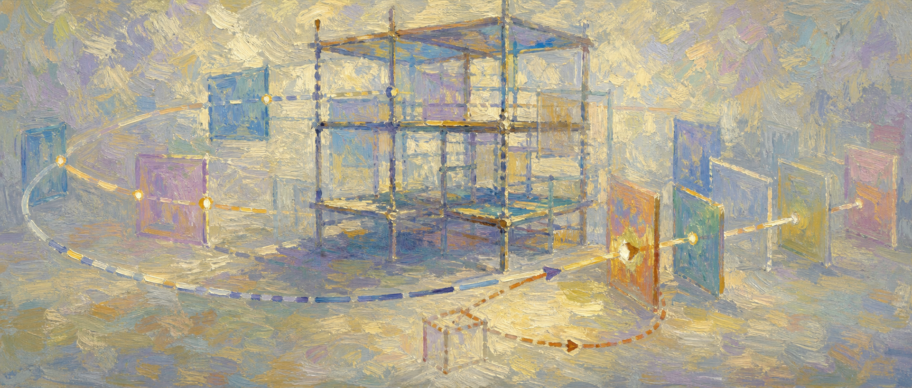

# Reharnessing：让 Agent 学会重搭自己的脚手架

> Harness 的意义不是把 Agent 永久框死，而是让它在可审计的边界里，逐渐学会提出“这个边界本身哪里该改”。

过去我们谈 Agent 可靠性，常常会走向 Harness Engineering：给 Agent 设定工具、上下文、权限、流程、验证器和人工确认点。它像一套脚手架，把模型的随机性变成可交付的工作流。

但这里有一个矛盾：脚手架越结实，Agent 越稳定；可脚手架越固定，Agent 越难自我提高。

这篇要解决的痛点是：当 Agent 被 harness 框住以后，它还能不能成长？我的判断是，可以。但成长对象不能只放在 prompt、skill 或 memory 上，而要进入一个更外层的闭环：**Reharnessing**。

Reharnessing 不是让 Agent 自由拆掉笼子。它是让 Agent 基于运行轨迹提出 harness 修改，再由回放、评测、权限门和人审决定是否采纳。

## 问题不在框住

Harness Engineering 的第一反应是正确的。生产环境里，不能把写邮件、改数据库、发 PR、调内部 API 这类动作交给一句“请谨慎操作”。

所以我们把 Agent 放进流程：先计划，再调用工具；先验证，再写入；先生成草稿，再人工确认；权限按任务发放，状态按会话保存，错误按日志追踪。

问题不是有 harness。

问题是很多 harness 一旦写好，就变成新的硬编码。Agent 每天在里面跑，产生大量失败轨迹、重复搜索、人工打断、审稿意见、回滚记录，但这些信号最后只被总结成一句“下次注意”。

这就像给一个新员工安排了 SOP，却从不允许他指出 SOP 过期了。你以为是在管理风险，其实是在浪费经验。

## 自我改进要越过提示词

旧稿 [[2026-05-25 Agent 自我改进，不该只改提示词]] 已经讲过一层：很多 Agent 失败不是 prompt 能修的。失败可能发生在 skill、runtime、工具契约、状态机，甚至源码层。

这次我们再往前推一步：如果 harness 本身决定了 Agent 能看到什么、能做什么、什么时候停、如何验证，那么 harness 也必须成为学习对象。

几篇最近的研究刚好拼出这条路。

[[Trace2Skill Verifier-Guided Skill Evolution for Long-Context EDA Agents]] 说明，失败轨迹和 verifier feedback 可以演化 skill，而不只是靠人工润色提示词。

[[Adapting the Interface Not the Model Runtime Harness Adaptation for Deterministic LLM Agents]] 更进一步：不改模型权重，也不改环境，而是从 recurring interaction failures 里提取 runtime interventions，去改 observation、action realization 和 trajectory regulation。

[[MOSS Self-Evolution through Source-Level Rewriting in Autonomous Agent Systems]] 则把边界推到源码：如果 routing、hook 顺序、state invariant、dispatch 和 rollback 写在代码里，那文本层自我改进就碰不到根因。它的解法不是让模型直接上线自改代码，而是用 failure batch、trial worker、replay、user gate、health probe 和 rollback 组成发布流水线。

这些材料共同指向一个结论：Agent 的自我提高，不是“模型自己变聪明”，而是系统会把失败放回正确的结构层。

## 什么是 Reharnessing

我会这样定义 Reharnessing：

> Reharnessing 是一种 trace-driven harness evolution：从 Agent 的执行轨迹、失败案例、人工干预和验证反馈中，提出对上下文、工具、流程、权限、验证器、memory 和 source patch 的修改，并通过回放与治理机制选择性合并。

它和普通 self-improvement 的区别，在于改进对象不同。

普通 prompt iteration 问的是：下次怎么说得更清楚？

Skill evolution 问的是：哪些流程经验应该沉淀成可复用技能？

Memory update 问的是：哪些事实和偏好应该被记住？

Reharnessing 问的是：**这个 Agent 下次应该被怎样重新框住？**

这不是语义游戏。因为很多失败不是 Agent 没努力，而是 harness 给了错误路径。

工具返回太散，Agent 就会重复搜索。审稿规则太晚出现，文章就会写完才返工。关系图谱没有结构化差异判断，新增摘录就容易被误判为可成稿。封面生成失败没有独立状态，文章链路就会被不必要地阻塞。

这些都不是“模型下次更认真”能解决的，它们需要改脚手架。

## 失败现场：会写稿，但不会改流程

拿这个公众号自动化来说。

它每天会检查来源、筛选摘录、回看历史稿、判断是否成稿、生成封面、写主编审稿、更新关系图谱和 memory。这个 harness 已经不薄了，甚至有点像一个小编辑部。

但它也会暴露典型问题。

比如连续几天都遇到“主题相邻但不应成稿”的情况，系统已经在复盘里写下了判断经验：质量门主题要区分计划层、规格层、反馈资产、反博弈；记忆主题要区分存储、检索、压缩、修订、仲裁和治理。

如果这些经验永远停留在复盘单里，下一次运行还要靠模型临场想起，就不算真正学会。

Reharnessing 的做法不是马上把所有复盘句子塞进总编指令。那会让规则越来越肿。

更好的做法是把每次运行拆成两类输出：

- 内容产物：摘录、文章、封面、审稿单、图谱。
- Harness 产物：这次运行暴露了哪个流程缺陷，应该改哪个环节，证据是什么，风险是什么，能不能用历史运行回放验证。

也就是说，自动化不只问“今天写了什么”，还问“今天这个编辑部的工作制度要不要改”。

## 改脚手架要有闸门

Reharnessing 最容易走偏的地方，是把它误解为“Agent 可以自己改规则”。

不行。至少生产系统里不行。

Agent 可以提出 reharness proposal，但不能自己批准进入主流程。

一个可靠闭环应该像这样：

- **Trace 捕获**：记录每次运行的来源覆盖、筛选理由、跳过理由、成稿判断、审稿必改项、图谱回链、封面状态和 memory 写入。
- **Failure Mining**：识别重复失败，例如主题重复、候选遗漏、审稿必改项反复出现、封面比例错误、图谱漏回链。
- **Harness Proposal**：提出具体修改，不是泛泛说“加强审查”，而是说明要改 task prompt、总编候选、复盘模板、检查脚本还是文件结构。
- **Replay / Backtest**：用最近 7 次运行做回放，判断新规则是否能减少返工，同时不会误杀好选题。
- **Human Gate**：只把通过验证的修改放进候选规则或任务包，关键规则再由总编合并。
- **Versioned Rollback**：每次 harness 改动有版本、原因、证据和回滚点。

这其实把 Agent 自我提高从“反思文学”变成了“制度变更管理”。

## 先在公众号自动化里试一刀

最小可行实验不需要大改系统。

我建议先给 `ai-research` 加一个 Reharnessing 观察层，不改主流程，只增加一个轻量产物：每次自动化复盘末尾多生成一个 `Reharnessing 候选` 小节。

里面只回答 5 个问题：

- 本次返工或低效来自内容判断，还是来自 harness 设计？
- 如果要改，是改来源筛选、成稿判断、审稿模板、封面链路、图谱更新，还是 memory 同步？
- 这条修改有几次历史证据支持？
- 能不能用最近 7 次运行回放验证？
- 是否应该进入候选规则，而不是直接改总编指令？

第一阶段只收集，不自动合并。

第二阶段再做小范围验证：挑一个反复出现的问题，比如“主题相邻但误成稿”或“审稿必改项重复出现”，把它写成候选 harness rule，然后用最近 7 篇文章和复盘单回看：这条规则会拦住哪几篇？会不会误伤？

第三阶段才进入任务包：修改 `task-prompt.md`，记录 CHANGELOG，并在下一次运行里观察指标是否改善。

这就是把 Reharnessing 从概念变成实验。

## 真正高级的 Agent，会报告自己被框错了

未来的 Agent 系统不会只比“模型更强”。

更重要的是，它能不能回答一个更成熟的问题：这次失败到底应该改哪里？

改 prompt，是最浅的一层。改 skill，是把经验沉淀成流程。改 memory，是让系统记住证据和口径。改 runtime，是修复模型和世界之间的接口。改 source，是处理状态机、路由和发布治理。

而 Reharnessing，是把这些层级放进同一个受控循环：Agent 可以指出脚手架哪里卡住了，但脚手架怎么改，要经过证据、回放、审计和人审。

这也是 Harness Engineering 的下一阶段。

不是把 Agent 框得越来越死。

而是让 Agent 在边界里工作，在轨迹里学习，在复盘里提出制度变更，然后由系统决定哪些变更值得合并。

好的 harness 不是笼子。

它更像会被工程化维护的脚手架：今天保护施工，明天根据施工记录调整结构。

## 参考链接

- [MOSS: Self-Evolution through Source-Level Rewriting in Autonomous Agent Systems](https://arxiv.org/abs/2605.22794)
- [Adapting the Interface, Not the Model: Runtime Harness Adaptation for Deterministic LLM Agents](https://arxiv.org/abs/2605.22166)
- [Trace2Skill: Verifier-Guided Skill Evolution for Long-Context EDA Agents](https://arxiv.org/abs/2605.21810)
- [Shepherd: A Runtime Substrate Empowering Meta-Agents with a Formalized Execution Trace](https://arxiv.org/abs/2605.10913)
- [Scaling Laws for Agent Harnesses via Effective Feedback Compute](https://arxiv.org/abs/2605.29682)
- [Introducing dynamic workflows in Claude Code](https://claude.com/blog/introducing-dynamic-workflows-in-claude-code)

## 关联笔记

- 来源摘录：[[MOSS Self-Evolution through Source-Level Rewriting in Autonomous Agent Systems]]
- 来源摘录：[[Adapting the Interface Not the Model Runtime Harness Adaptation for Deterministic LLM Agents]]
- 来源摘录：[[Trace2Skill Verifier-Guided Skill Evolution for Long-Context EDA Agents]]
- 来源摘录：[[Shepherd A Runtime Substrate Empowering Meta-Agents with a Formalized Execution Trace]]
- 来源摘录：[[Scaling Laws for Agent Harnesses via Effective Feedback Compute]]
- 相关摘录：[[SpecBench Evaluating Specification-Level Reasoning for Software Engineering LLM Agents]]、[[Review Arcade On the Human Alignment and Gameability of LLM Reviews]]
- 相关旧稿：[[2026-05-25 Agent 自我改进，不该只改提示词]]、[[2026-05-27 Agent 的复利，不是记住更多，而是少写错经验]]、[[2026-05-30 别让 Agent 白白烧掉反馈]]
